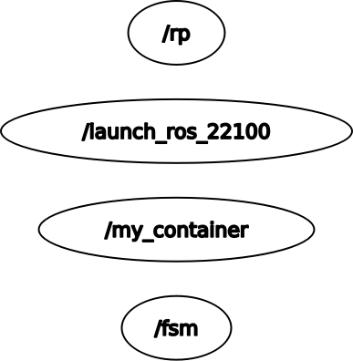

# PACKAGES NEEDED
Other than this package you will need to download and build two other packages, [rt2_ros2](https://github.com/jacopociro/rt2_ros2) and [ros1_bridge](https://github.com/ros2/ros1_bridge).
In your terminal go to your ros2 workspace, inside the src folder, and run:
```
git clone https://github.com/ros2/ros1_bridge.git
git clone https://github.com/jacopociro/rt2_ros2.git
```
Then you'll need to open three different terminal, to source the different ros installation.
The files to source are saved in the rt2_ros2 package under the name ros1.sh, ros2.sh and ros12.sh. You can move these as preferred.
In the first terminal run (from wherever it is saved in):
```
source ros1.sh
```
Then move to the ros_ws and run:
```
catkin_make
```
and leave the terminal open.
In the second terminal run (from wherever it is saved in):
```
source ros2.sh
```
Then move to the ros2_ws and run:
```
colcon build  --packages-select ros1_bridge --cmake-force-configure
```
and leave the terminal open.
In the third terminal run (from wherever it is saved in):
```
source ros12.sh
```
Then move to the ros2_ws and run:
```
colcon build --symlink-install --packages-skip ros1_bridge
```
and leave the terminal open.

# DESCRIPTION OF CONTENT OF THE PACKAGE
The package is composed of:
- Four nodes: 
    - Two in ros1:
        - go_to_point.py
        - user_interface.py
    - Two in ros2:    
        - position_service.cpp
        - state_machine.cpp
- Three custom services in both ros1 and ros2:
    - Command.srv
    - Position.srv
    - RandomPosition.srv
- Two launch files:
    - One in ros1:
        - sim.launch
    - One in ros2:
        - sim.py
- One urdf file:
    - my_robot.urdf

## NODES
### go_to_point.py
Implements a service (Position.srv) that, when called, requests a position , runs the algorithm to control the robot and return a boolean true value as response. The algorithm reads from /odom the current position and orientation and, knowing the goal, calculates the linear and angular speed to send on the /cmd_vel topic. All of this is done with a state machine that has three states.
### user_interface.py
Implements the call for a service (Command.srv) for a user input and then, when it is received, launches the server in go_to_point.py. When the user hits the input for stopping the robot, the robot will reach the last goal received and then will stop.
### position_service.cpp
Implements a service (RandomPosition.srv) that, given a range, returns a random position for the robot to reach.
### state_machine.cpp
This is the node that calls both the services in go_to_point.py and position_service.cpp and the service that is called in user_interface.py. This node waits for user_interface.py to tell it to call the other two services and start the robot.

## GAZEBO SIMULATION
This package is uses a gazebo simulation. The robot urdf is defined in my_robot.urdf

# HOW TO RUN THE PACKAGE
In the first terminal you will need to run the roscore and the nodes using the launch file:
```
roslaunch rt2_assignment1 sim.launch
```
In the third terminal you will need to run the ros bridge:
```
ros2 run ros1_bridge dynamic_bridge
```
Lastly in the second terminal run the ros2 nodes:
```
ros2 launch rt2_ros2 sim.py
```
Now input 1 on the first terminal waiting for you. 
Press 0 to stop the robot.
# ROBOT BEHAVIOUR
The robot spawns in (0.0) and stays still until the user input tells it to move. It will then start moving to a random position and when it reaches this position will start going to a new random position until the user tells it to stop.

# SYSTEM ARCHITECTURE




We have the node state_machine.cpp that is the center of the application, communicating with user_interface.py and calling the services and the action server in go_to_point.py and position_service.cpp. The node go_to_point.py is tasked with communication to the gazebo simulation, via publisher/subscriber on both /odom and /cmd_vel.

# SYSTEM LIMITATIONS AND POSSIBLE FUTURE IMPLEMENATIONS
Possible future implementations could be solving the issue with stopping the robot that crashes the processes. This is probably due to the hardware I was running the simultation on as it lacked RAM.

