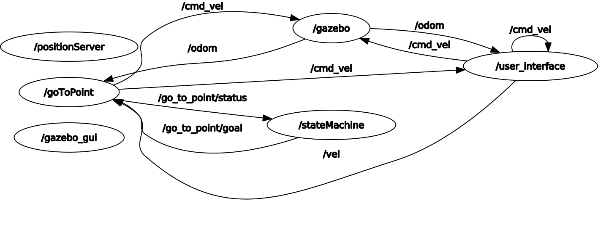

# DESCRIPTION OF CONTENT OF THE PACKAGE
The package is composed of:
- Four nodes: 
    - go_to_point.py
    - user_interface.py
    - position_service.cpp
    - state_machine.cpp
- Three custom services:
    - Command.srv
    - Position.srv
    - RandomPosition.srv
- One launch file:
    - sim.launch
- One action file:
    - Mov.action
- One urdf file:
    - my_robot.urdf

## NODES
### go_to_point.py
Implements the action service (Mov.action) that, when called, requests a position , runs the algorithm to control the robot and return a boolean true value as response. The algorithm reads from /odom the current position and orientation and, knowing the goal, calculates the linear and angular speed to send on the /cmd_vel topic. All of this is done with a state machine that has three states.
### user_interface.py
Implements the call for a service (Command.srv) for a user input and then, when it is received, launches the server in go_to_point.py. When the user hits the input for stopping the robot, the robot will reach the last goal received and then will stop.
### position_service.cpp
Implements a service (RandomPosition.srv) that, given a range, returns a random position for the robot to reach.
### state_machine.cpp
This is the node that calls both the services in go_to_point.py and position_service.cpp and the service that is called in user_interface.py. This node waits for user_interface.py to tell it to call the other two services and start the robot.

## GAZEBO SIMULATION
This package is uses a gazebo simulation. The robot urdf is defined in my_robot.urdf

# HOW TO RUN THE PACKAGE
Open up two terminals. In the first one you will need to run the roscore and the nodes using the launch file:
```
roslaunch rt2_assignment1 sim.launch
```
Now input 1 on the terminal waiting for you. 
Press 0 to stop the robot.
# ROBOT BEHAVIOUR
The robot spawns in (0.0) and stays still until the user input tells it to move. It will then start moving to a random position and when it reaches this position will start going to a new random position until the user tells it to stop.

# SYSTEM ARCHITECTURE

We have the node state_machine.cpp that is the center of the application, communicating with user_interface.py and calling the services and the action server in go_to_point.py and position_service.cpp. The node go_to_point.py is tasked with communication to the gazebo simulation, via publisher/subscriber on both /odom and /cmd_vel.

# SYSTEM LIMITATIONS AND POSSIBLE FUTURE IMPLEMENATIONS
Possible future implementations could be:
- a user interface to send user chosen goals instead of random ones.
- a way to stop the robot without aborting the goal. 

